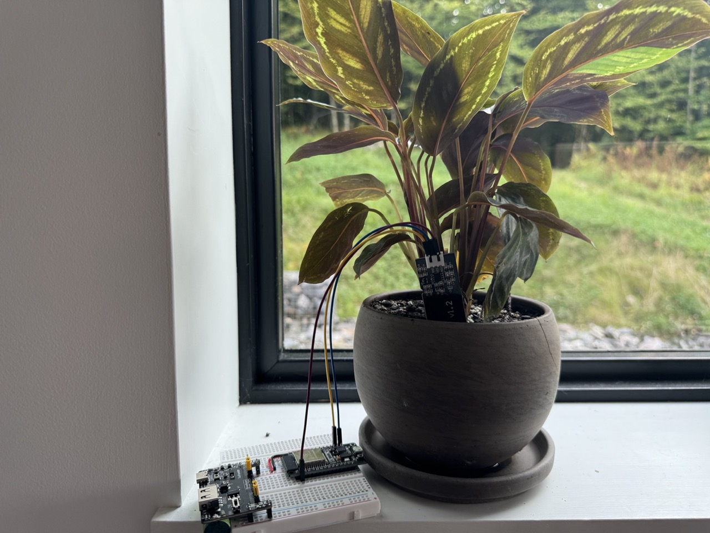
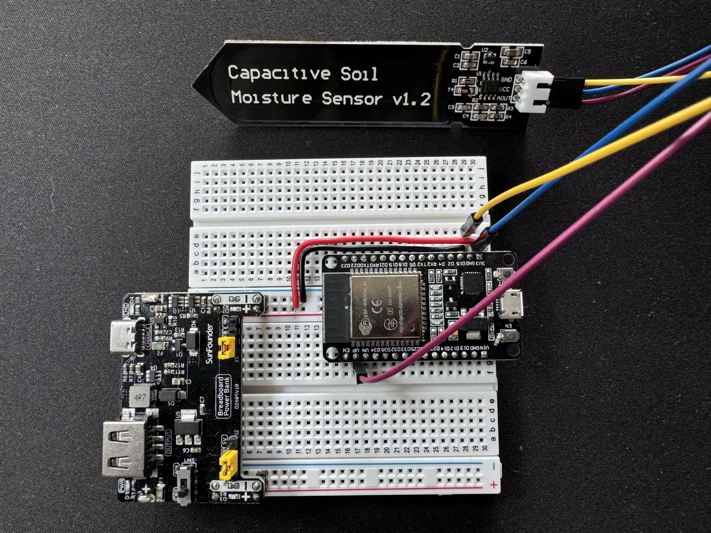

# Plant Watch

**See my plant data here:** https://linux.plant-watch.com/
- You'll notice a lot of jumping around on the chart. I have yet to solve the battery drain problems. The blips are when I have disconnected batteries to charge.

**Plant Watch** is a smart plant monitoring system that keeps track of soil moisture levels for houseplants using ESP32 microcontrollers and soil moisture sensors. This project aims to explore IoT, microcontroller integration, and self-hosting solutions while providing a practical tool for plant care.

## Features

- Real-time soil moisture monitoring
- Visual representation of moisture data over time (last 100 readings)
- Responsive web interface for viewing data
- Automatic data logging every hour
- Self-hosted on a linux-based VPS with automatic restarts using PM2

### Planned Features

- Notifications for low moisture levels
- Improved battery management for ESP32 devices
- Integration with other sensors (e.g., temperature, humidity)
- Enhanced data visualization (e.g., historical data analysis)
- Sqlite for long-term data storage



## Installation & Setup

### Prerequisites

- Node.js and npm installed
- ESP32 microcontrollers and soil moisture sensors

### Steps

## Server

1. Clone the repository:
   ```bash
   git clone https://github.com/yourusername/plant-watch.git
   cd plant-watch
   ```
2. Install dependencies:

   ```bash
   npm install
   ```

3. Delete API related code

4. Start the application:

   ```bash
   npm start
   ```

5. Access the application at `http://localhost:3000`.

## Esp32

1. Connected the ESP32 to the sensor as shown in the photo. I have since switched to a more robust power supply, using lithium ion batteries.
   

2. Using the Ardruino IDE, verify and upload the code in esp32.ino to your Esp32.

- Replace the ssid and password with your local network, and change the serverName to localhost:3000/data.
- Change the plant name to your own.

## Usage

- Access the web interface at `http://localhost:3000` to view live moisture data.
- The chart displays the last 100 moisture readings, updated every hour.
- Future features will include notifications for when moisture levels fall below a certain threshold.

## License

This project is licensed under the MIT License.
